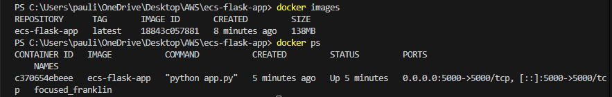
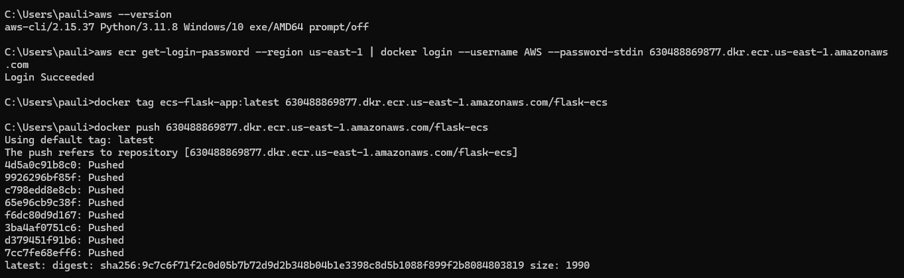
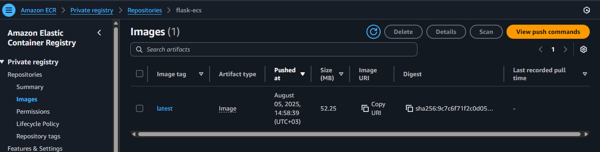
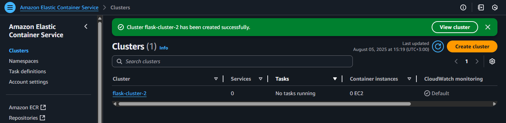
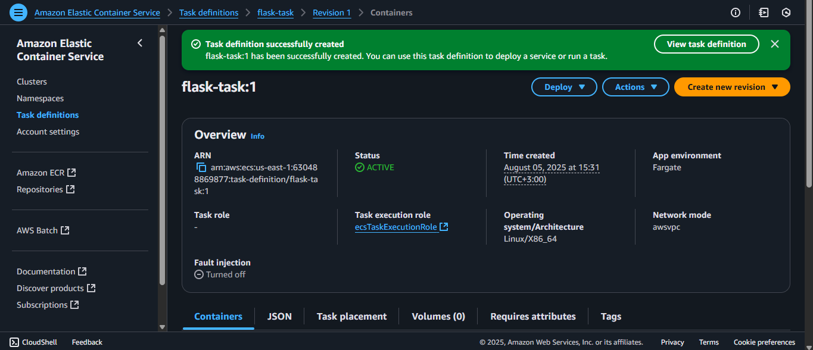
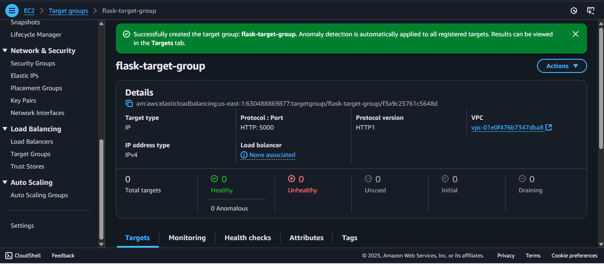
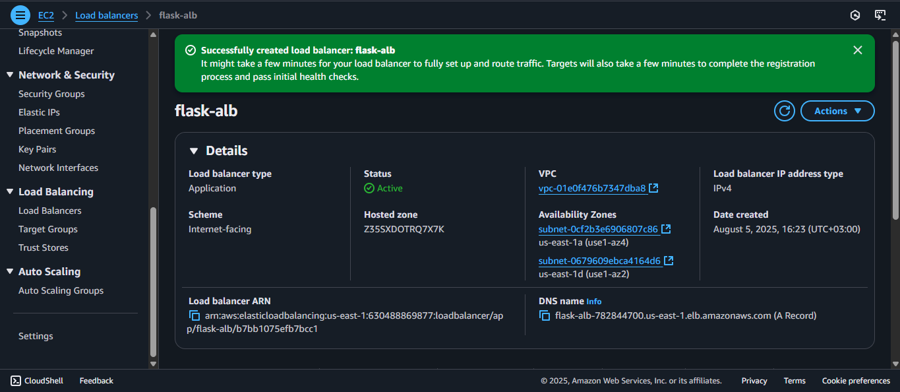
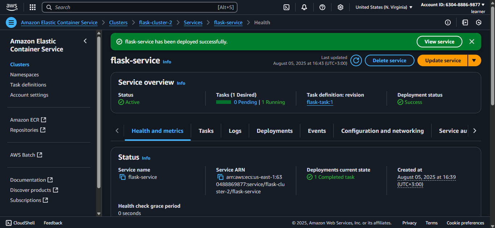
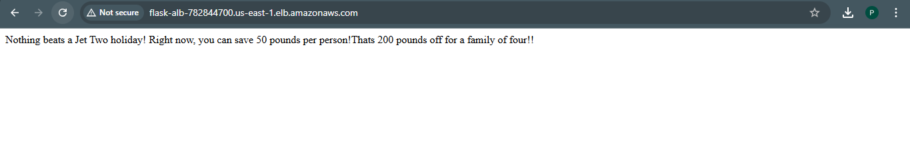

# Containerize a Python Flask App & Deploy on AWS ECS (Fargate)

## Project Summary
This project demonstrates how to package a Python Flask application into a Docker container and deploy it on AWS ECS using Fargate — a serverless compute engine for containers. This setup removes the need to manage infrastructure, while showcasing container orchestration and cloud-native deployment practices.


## Prerequisites
- AWS CLI installed and configured (aws configure)
- Docker installed
- IAM permissions to use ECS, ECR, ALB, and VPC
- A default VPC and subnets available


## Project Structure
```text
ecs-flask-app/
├── app.py              
├── requirements.txt   
├── dockerfile           
├── README.md
└── screenshots/
    ├── alb_created_active.png
    ├── dockerimage_build_and_run.png
    ├── ecr_docker_push_success.png
    ├── ecr_pushed_image.png 
    ├── ecs_cluster_created.png
    ├── flask_service_successfully_deployed.png
    ├── target_group_created.png
    ├── task_definition_created.png
    └── testing.png    
```


## Tech Stack & AWS Services Used

- Flask – Lightweight Python web framework.
- Docker – Containerized the Flask app.
- Amazon ECR (Elastic Container Registry) – Stored Docker image.
- Amazon ECS (Elastic Container Service) – Managed containers.
- Fargate – Serverless compute engine for containers.
- Application Load Balancer – Routed traffic to ECS service.
- Security Groups – Controlled access to the app.
- VPC, Subnets, ENIs – Provided networking for the ECS task.


## Steps Followed

### 1. Containerize the Flask App Locally
- Wrote `app.py` (Flask app running on port 5000).
- Created a `Dockerfile` and built an image named `ecs-flask-app`.
- Tested locally via `docker run -p 5000:5000 ecs-flask-app`.

### 2. Push Image to Amazon ECR
- Created an ECR repo named `flask-ecs`.
- Authenticated Docker with ECR.
- Tagged and pushed image to ECR.

### 3. Setup ECS Cluster
- Created an ECS Cluster named `flask-cluster-2` using Fargate launch type.

### 4. Create Task Definition
- Defined container specs: image URL, memory, CPU, and port 5000.
- Set log configuration (awslogs) for monitoring.

### 5. Configure Security Group
- Allowed inbound traffic on port 5000 from `0.0.0.0/0`.
- Attached SG to Load Balancer and ECS tasks.

### 6. Create Load Balancer & Target Group
- Created an Application Load Balancer (ALB).
- Created a Target Group pointing to IP addresses.
- Used port 5000 and HTTP health checks.

### 7. Register Targets Automatically via ECS Service
- Skipped manual IP registration.
- ECS Service auto-registered running task to Target Group.

### 8. Create ECS Service
- Linked Service to Cluster, Task Definition, and Load Balancer.
- Set desired count to 1.

### 9. Deployment & Testing
- Retrieved the ALB DNS name.
- Accessed (http://flask-alb-782844700.us-east-1.elb.amazonaws.com/) and confirmed Flask app loaded.
**This site was temporarily hosted for demonstration and learning purposes and has since been deleted to avoid incurring charges.**

  
*Flask service deployed and tested live*


## Security & Network Configuration

- Used default VPC and public subnets.
- Automatically assigned public IP to the task.
- ENIs were auto-created by ECS.
- Security Group allowed traffic on port 5000.


## Screenshots
### Docker build and run
  
*Docker image build and run success*

### ECR repository creation and image push
 
*Docker image was successfully tagged and pushed to the ECR repo*
  
*Shows image listed in ECR*

### ECS cluster and task definitions

*Shows the ECS cluster I created (flask-cluster-2)*

  
*Defines the container settings (image URL, port mapping, etc.)*

## Load Balancing Configuration
  
*Created a Target Group that will forward traffic to your ECS Task IP on port 5000*

  
*Application Load Balancer is created and is in an ACTIVE state, ready to route traffic*

### Flask service deployed and tested live
  
*Confirms your ECS service was deployed and task is attached to ALB*

  
*The app was tested live using the ALB DNS URL, and it responded correctly.*


## Skills Gained

- Dockerizing Python apps.
- Working with AWS ECR, ECS, and Fargate.
- Networking in AWS (VPC, subnets, security groups).
- Hands-on container deployment in the cloud.
- Load balancing and target group configuration.
- Understanding of serverless container orchestration.


## Author

Built by Pauline Andege as part of AWS projects.