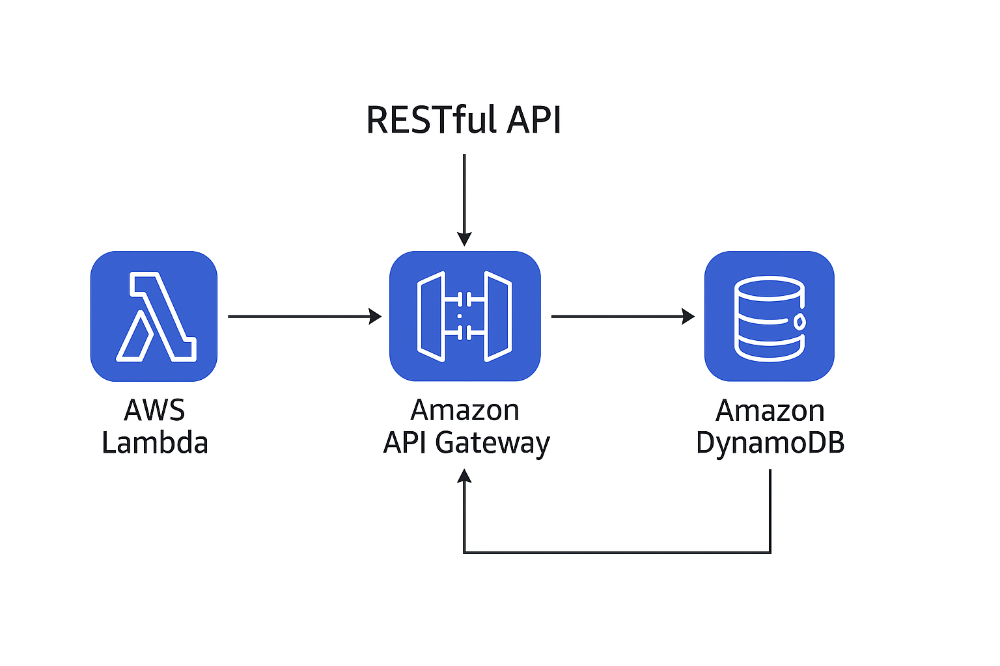
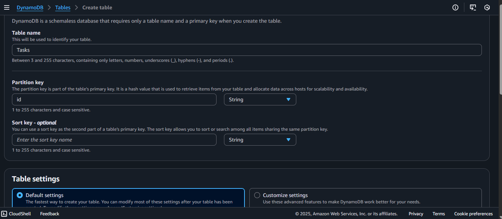
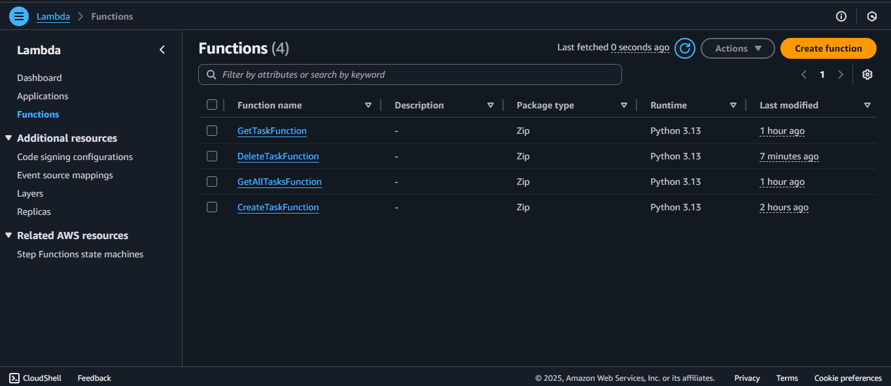
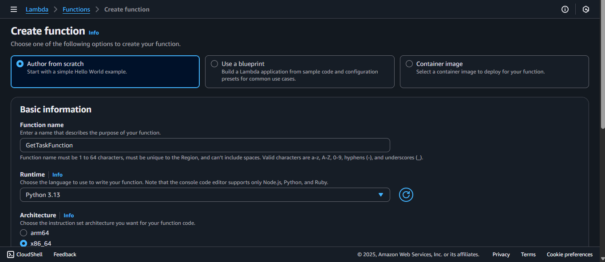
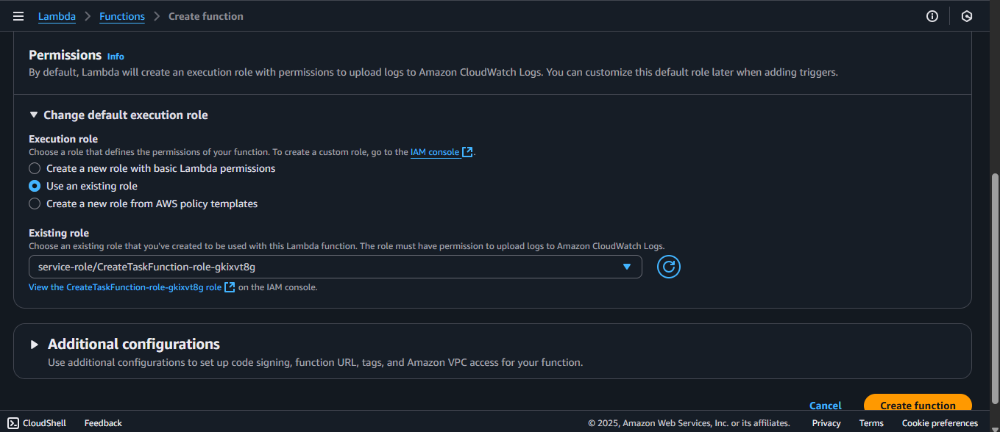
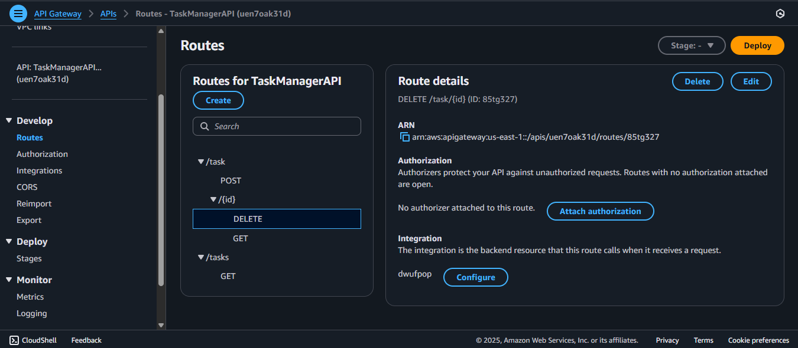
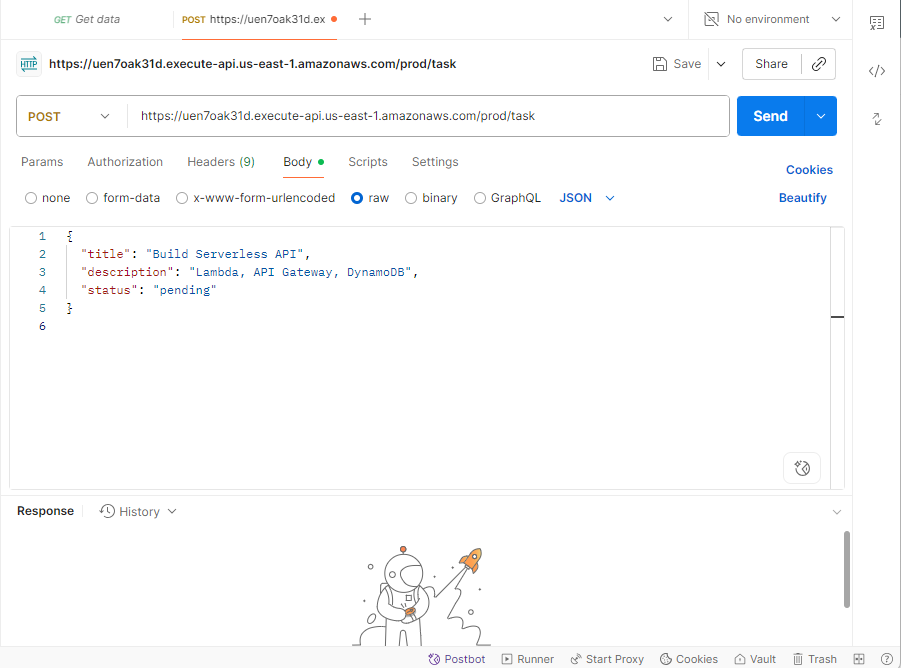
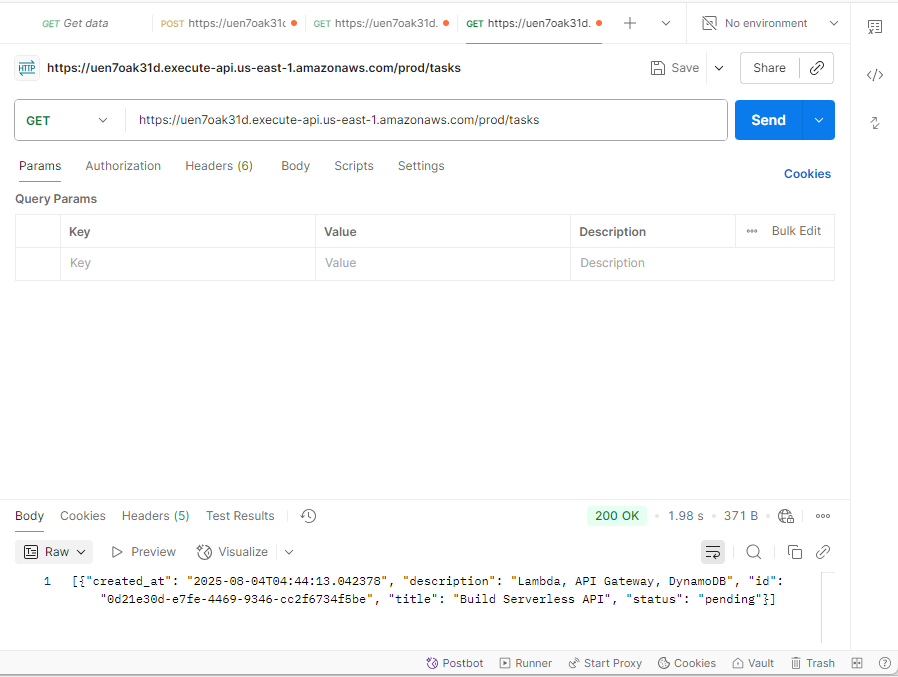

# 🧠 Serverless Task Management API (AWS Lambda + API Gateway + DynamoDB)

A fully functional RESTful API built with AWS serverless architecture, enabling basic task management operations like Create, Read, and Delete — without managing any servers.

## 🧾 Project Description

This is a CRUD-style API that uses:
- AWS Lambda - for serverless computing.
- API Gateway - to expose the endpoints securely
- DynamoDB - to store task data (id, title, description, status)

## 🚀 Features

- `POST /task` — Create a new task.
- `GET /task/{id}` — Retrieve a task by its ID.
- `GET /tasks` — Retrieve all tasks.
- `DELETE /task/{id}` — Delete a task by ID.

## 🧱 Architecture

The architecture follows a clean serverless design:

*Architecture showing API Gateway -> Lambda -> DynamoDB.*

## 🛠️ Tech Stack

| AWS Service         | Purpose                                      |
|---------------------|----------------------------------------------|
| Lambda              | Run backend code for each endpoint           |
| API Gateway         | Provide public-facing API endpoints          |
| DynamoDB            | NoSQL database to store task data            |
| IAM                 | Manage permissions securely                  |
| CloudWatch          | Log and monitor Lambda invocations           |
| Python              | Lambda funtions language                     |

## 🧠 Lessons Learned
- Gained practical experience in serverless design.
- Understood how to manually connect Lambda → API Gateway → DynamoDB.
- Learned how to debug API errors using CloudWatch Logs.
- Practiced using IAM roles and permissions effectively.
- Learned to monitor and optimize DynamoDB read/write capacity.

## 📷 Screenshots

### DynamoDB Table
  
*Created DynamoDB table to store task data.*

### Lambda Functions
  
*All Lambda functions for CRUD operations.*

  
*Setting up a Lambda function for GET /task.*

  
*Attaching an existing IAM role to a Lambda function.*

### API Gateway
  
*API Gateway routes for all task endpoints.*

### Postman Testing

#### POST `/task`
  
*Postman request interface for creating a task.*

  
*Successfully created a task via POST.*

#### GET `/task/{id}`
  
*Successfully retrieved a task by ID.*

#### DELETE `/task/{id}`
  
*Successfully deleted a task by ID.*

## 🧹 Cleanup

All AWS resources (Lambda, API Gateway, DynamoDB) were manually deleted after project completion to avoid incurring unnecessary charges.

## ⚡ Challenges Faced

- Debugging internal server errors using CloudWatch logs
- Managing route parameters like `/task/{id}` in API Gateway

## 🚧 Future Enhancements

- Add `PUT` (replace) and `PATCH` (partial update) functionality
- Integrate request validation (e.g., check if `title` is empty)
- Add authentication using AWS Cognito
- Deploy infrastructure using Terraform or AWS SAM

## 👩‍💻 Author

Built by Pauline Andege as part of AWS projects.

