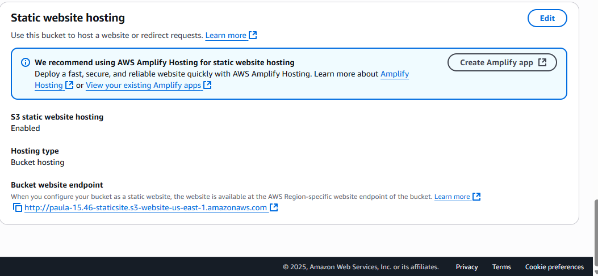
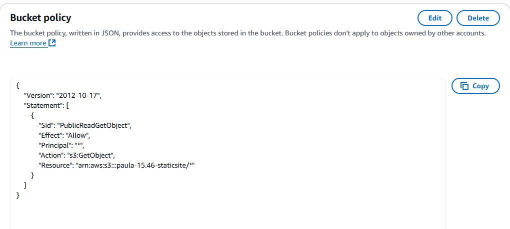
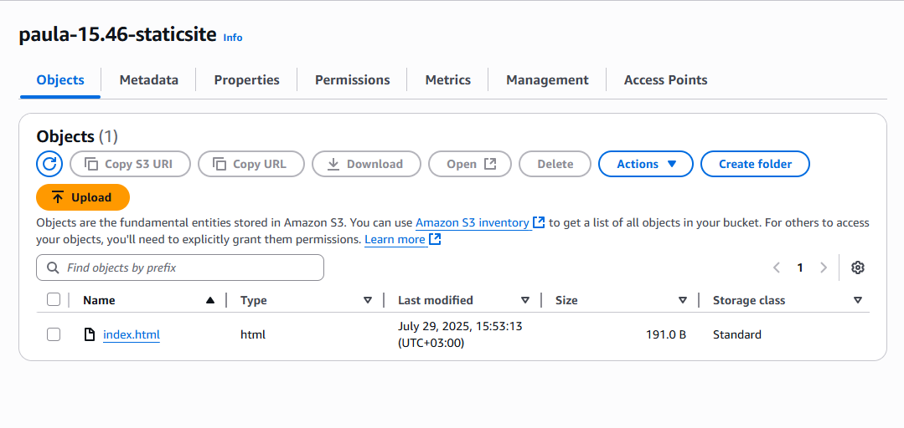
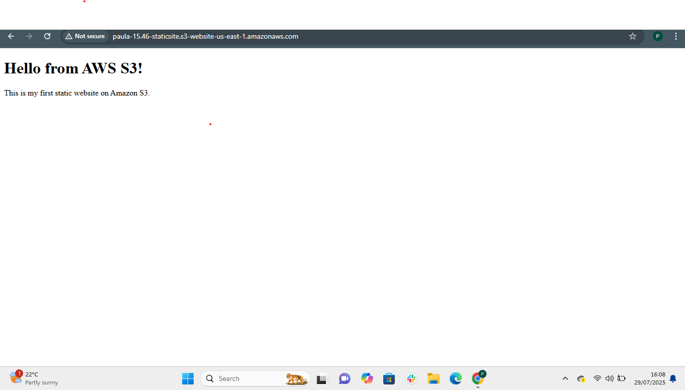

# 🌐 Static Website Hosting on AWS S3

This project demonstrates how to host a static website using Amazon S3. It includes uploading HTML files, configuring public access, and enabling static hosting using the AWS Management Console.


## 🛠️ What I built

- A basic static website (`index.html`).
- Hosted publicly on Amazon S3.
- Enabled static website hosting.
- Applied a bucket policy to allow public access.


## 🚀 Technologies used

- Amazon S3 – to host static website files
- HTML – for the frontend
- Git & GitHub – for version control

 🧊 NOTE: AWS resources used in this project (e.g., S3 bucket) were cleaned up after testing to avoid unnecessary billing. Screenshots below demonstrate the working setup before deletion.


## 🌍 Website URL

~ http://paula-15.46-staticsite.s3-website-us-east-1.amazonaws.com/
- This site was temporarily hosted for demonstration and learning purposes and the S3 bucket has been deleted to avoid incurring charges.


## 📁 Folder structure
```text
my-static-site/
│
├── index.html
├── README.md
└── screenshots/
    ├── static-hosting-enabled.png
    ├── bucket-policy.png
    ├── live-website.png
    └── s3-uploads.png
```

## 🔧 Steps I followed
### 1. Created an S3 Bucket:
- Gave it a unique name - paula-15.46-staticsite
- Unchecked 'Block all public access'

### 2. Uploaded Files:
- Uploaded index.html to the bucket.

### 3. Enabled static website hosting:
- Enabled the static website hosting feature in the Properties tab and set the default document to index.html.

### 4. Made the bucket public:
- Added a bucket policy to allow public access.
```json
{
  "Version": "2012-10-17",
  "Statement": [
    {
      "Sid": "PublicReadGetObject",
      "Effect": "Allow",
      "Principal": "*",
      "Action": "s3:GetObject",
      "Resource": "arn:aws:s3:::paula-15.46-staticsite/*"
    }
  ]
}
```

## 📸 Screenshots
### Static website hosting enabled in S3


### Bucket policy added for public access


### Website files uploaded to S3 


### Live website in browser



## 🧠 What I learned
- How to use S3 as a web host.
- How to configure public access safely.
- The role of bucket policies in access control.


## ✍️ Reflection
This was my first deployment of a static website on AWS. I learned how to:
- Upload and manage files in S3.
- Enable public hosting.
- Troubleshoot common access errors (e.g., Access Denied)

## 🔗 Related AWS Services:
- Amazon S3 - for static website hosting.
- IAM - for access control.
- CloudFront (Coming soon)

## 👩‍💻 Author

Built by Pauline Andege as part of AWS projects.


