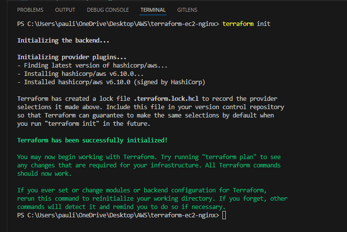
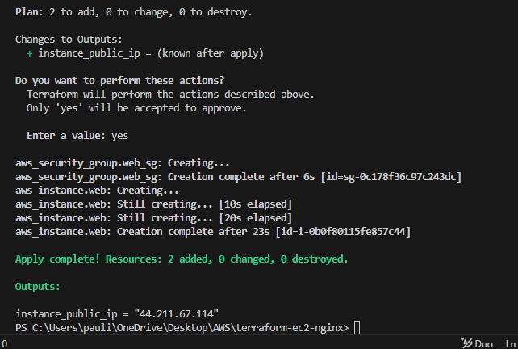
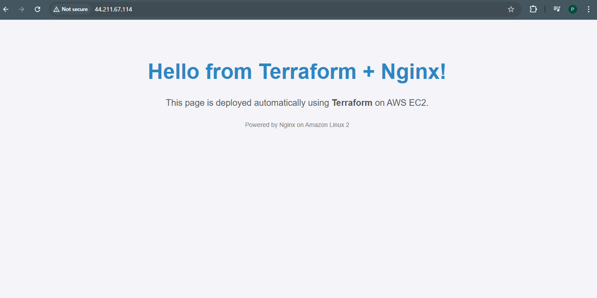
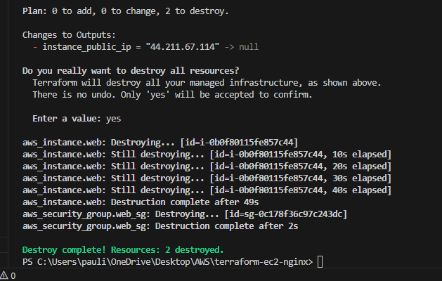

# Provision an EC2 Instance with Terraform & Deploy Nginx

## Project Summary
This project demonstrates how to use Terraform to provision an AWS EC2 instance, configure networking with a Security Group, and automatically install and configure Nginx via a user data script.


## Prerequisites
- AWS CLI installed and configured
- Terraform installed
- IAM permissions to use EC2, Security Groups,


## Project Structure
```text
terraform-ec2-nginx/
├── main.tf
├── outputs.tf              
├── userdata.sh.  
├── variables.tf           
├── README.md
└── screenshots/
    ├── terraform_init.png
    ├── terraform_apply.png
    ├── terraform_destroy.png
    ├── output.png   
```


## Tech Stack & AWS Services Used

- Terraform - Infrastructure as Code tool.
- Amazon EC2 - Virtual machine for hosting the web server.
- Amazon Linux 2 AMI - Operating system for the EC2 instance.
- AWS Security Groups - Controlled inbound and outbound traffic.
- Nginx - Web server installed automatically with *user_data.sh*.


## Steps Followed

### 1. Initialize Terraform
- I initialized terraform in my project folder to set up the working directory by running `terraform init`
  
*Showing results after initializing terraform in the project folder*

### 2. Apply Configuration
- I ran `terraform apply` to provision the EC2 instance, security group, and run the user data script.
  
*Showing results after successfully running terraform apply*

### 3. Access the Web Page
Copy the instance_public_ip from Terraform output and open it in the browser:
(http://http://44.211.67.114/) **This site was temporarily hosted for demonstration and learning purposes and has since been destroyed to avoid incurring charges.**
  
*Showing the end result of the project*

### 4. Destroy Infrastructure
- After testing, I cleaned up resources using `terraform destroy`.
  
*Showing successful removal of services used in the project*


## Skills Gained

- Writing **Infrastructure as Code** with Terraform.
- Provisioning and managing **AWS EC2 instances**.
- Configuring **security groups** for secure access.
- Using user_data scripts to automate server setup.
- Managing the lifecycle of cloud infrastructure: create → test → destroy.


## Author

Built by Pauline Andege as part of AWS projects.